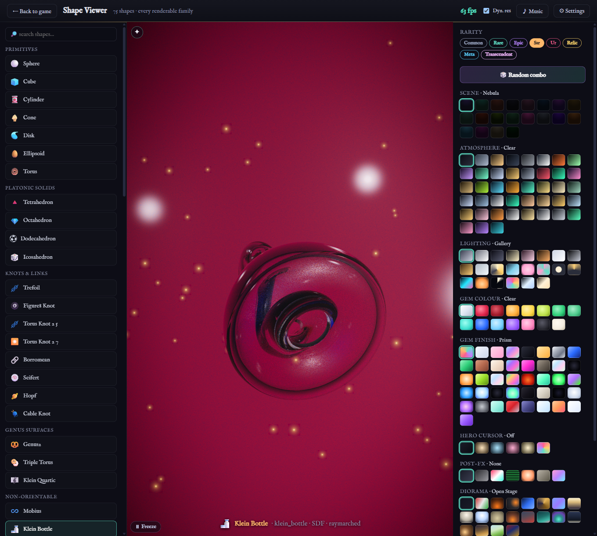

# Ship Shape Shop

A browser for looking at mathematical shapes. Pick a sphere, a torus knot, a Klein bottle, a 120-cell, the Stanford bunny — then dress it in materials, lighting, scenes and post-processing, and turn it around. It all renders in real time: raymarched SDFs, path-traced gems, real 4D projection. The render resolution scales itself to hold 60fps.

**[▶ Open it](https://gyng.github.io/shipshapeshop/)**

<b>There's a whole game hidden in here, too</b>

Add `?game` to the URL ([or just click here](https://gyng.github.io/shipshapeshop/?game)). It's a gacha + idle game where you collect the shapes, set them on a board to run an economy, glue them together in a forge (the real connected-sum), and send them on expeditions. The shapes are prettier than the game is fun, but it's all there.

### What you do

- **Pull or craft shapes.** The gacha hands you shapes; the Forge lets you glue two into a third. Gluing is the actual connected-sum, so Euler characteristics add, genus adds, and non-orientability spreads. The recipe system is topology, not a lookup table.
- **Deploy them on a board.** A shape's topology and where you put it decide how much currency it makes. The same board drives a generative lofi soundtrack, so the layout you're optimizing is the music you're hearing.
- **Raise bonds.** Every shape has a nickname, a voice built from its own geometry, and a bond that climbs when you visit it. The real mathematical name unlocks as a reward, not a tutorial.
- **Run expeditions.** Optional idle dungeon-crawler: send teams into the Manifold, clear rooms on auto, farm currency. There's a gambit editor for programming the combat, and a few fights where a good rule-set beats a stronger team playing dumb.
- **Finish it.** A day or two to the end, then New Game+ re-opens everything a dimension higher. No daily logins, no FOMO timers, no purchases, because there's nothing to sell.

### A look around

| The Orrery | Expeditions | The Forge |
|---|---|---|
|  |  |  |
| **Gallery** | **The Gacha** | **The Ledger** |
|  |  |  |

## Developers

A deterministic Rust core (the things that have to be true — RNG, economy, save state) compiled to WASM, with a React/TypeScript PWA and three.js gems on top. Architecture, the build commands, and the testing discipline are in [`AGENTS.md`](./AGENTS.md); game and economy design in [`DESIGN.md`](./DESIGN.md); the shader work in [`RENDERING_PLAN.md`](./RENDERING_PLAN.md); the cast and the Atlas frame in [`CHARACTERS.md`](./CHARACTERS.md).

## License

MIT or Apache-2.0, your pick: [MIT](./LICENSE-MIT), [Apache-2.0](./LICENSE-APACHE). Contributions come in under the same terms.

The optional Reference Wing tips its hat to a few famous graphics models (the Utah Teapot, the Stanford Bunny, Spot the cow). The shapes themselves are just mathematics, which nobody owns, but check the licence on any bundled model before you sell anything.
