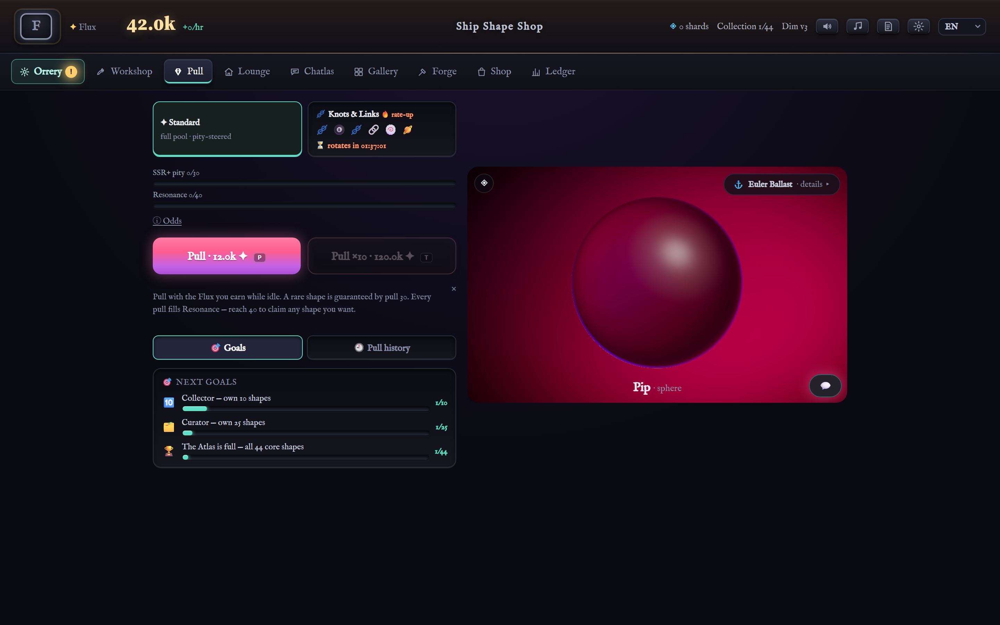
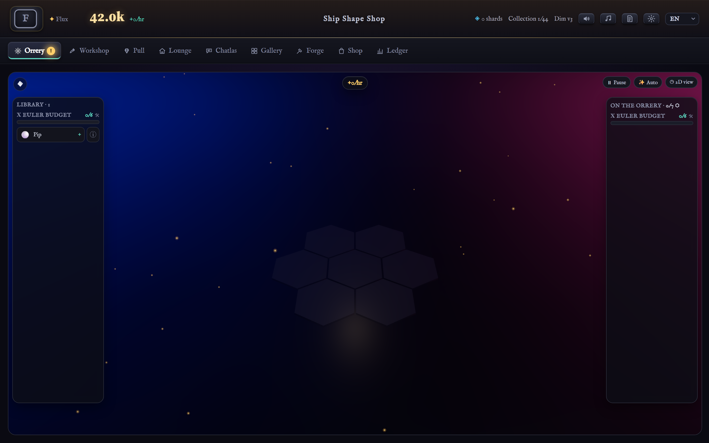
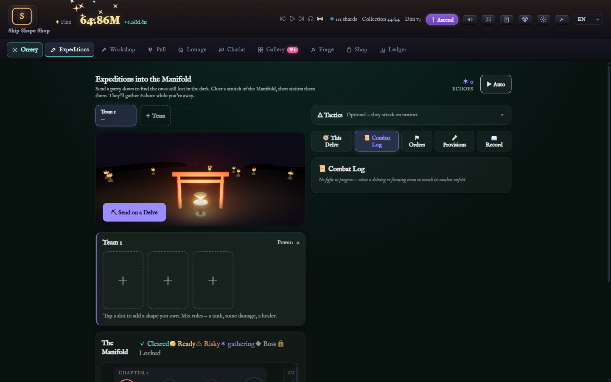
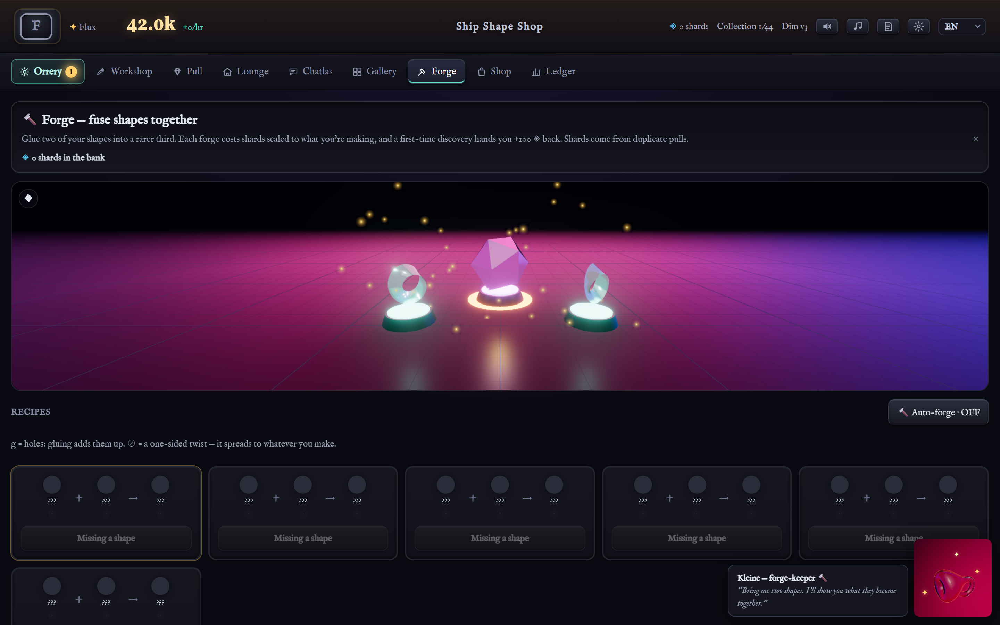
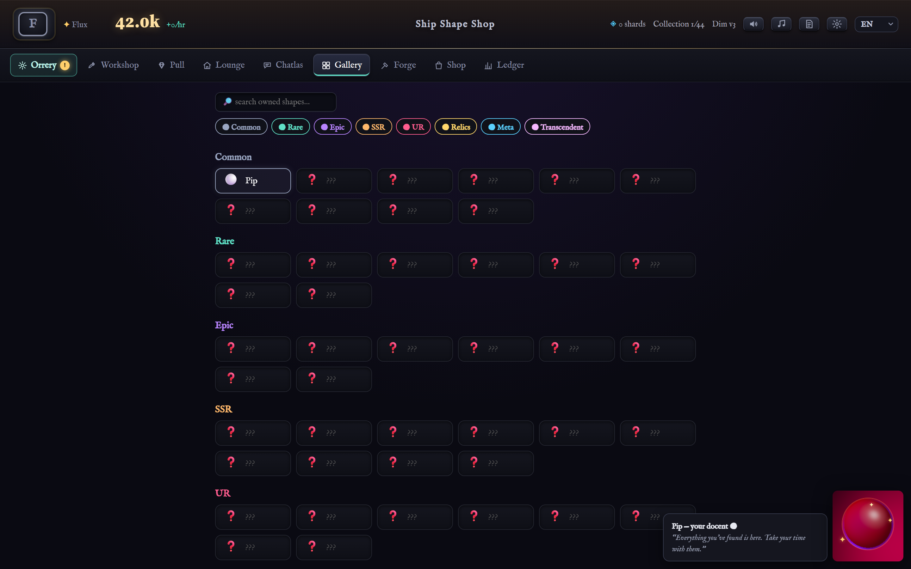
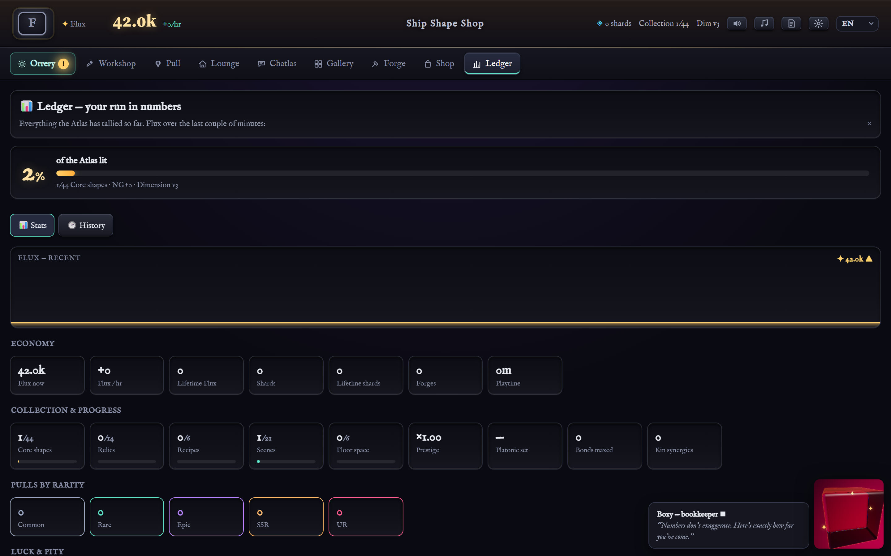

<div align="center">

# Ship Shape Shop

**A cabinet of mathematical shapes, kept like creatures — each with a name, a temperament, and a quiet opinion about where it sits.**

Pull them from the gacha. Set them on a hex orrery, where a shape's topology decides what it makes and how it sounds. Glue two together in the Forge — the real connected-sum; the maths *is* the recipe. Send the bold ones delving the Manifold. Calm on the surface, an optimization puzzle underneath, a little topology you absorb without noticing. It finishes in a day or two, and it never minds you leaving.

### [▶ Play in your browser](https://gyng.github.io/shipshapeshop/)

Free, no install, no accounts — a static PWA. *(Just here for the shapes? [Browse the whole cabinet →](https://gyng.github.io/shipshapeshop/?viewer))*

[](#license)
[](https://github.com/gyng/shipshapeshop/actions/workflows/ci.yml)



</div>

---

## What's inside

- **Two ways to acquire one.** Pull from the gacha, or *make* one in the Forge — gluing two surfaces is the genuine connected-sum (χ adds, genus adds, non-orientability is catching). The recipe book is just topology.
- **Shapes that talk back.** Each keeps a nickname, a voice derived from its own geometry, and a bond you raise by visiting. The real mathematical name is a thing you earn, never jargon thrown at you.
- **A board you can hear.** Deployed shapes drive both production *and* a generative lofi score — you end up listening to your own economy run.
- **Expeditions into the Manifold.** Send parties delving procedural dungeons: auto-combat, a *gambit* editor where a cleverer plan beats raw power, farmable Echoes. Opt-in, and fenced off so it never gates the calm game.
- **Finite, and unbothered by absence.** A day or two to the summit, extended by New Game+ — ascend a dimension, meet everyone again from higher up. No treadmill, no daily guilt, no dark patterns.

## A look around

| The Orrery | Expeditions | The Forge |
|---|---|---|
|  |  |  |
| **Gallery** | **The Gacha** | **The Ledger** |
|  |  |  |

## How it's built

> **One rule:** *Rust decides what is true; TypeScript decides how it looks and feels.* Every authoritative number — RNG, pity, economy, offline catch-up — lives in the deterministic Rust core, compiled to WASM. The web layer mirrors and tweens that truth; it never invents it.

| Layer | Tech |
|---|---|
| **Simulation core** | Rust → WebAssembly, 100% deterministic, unit + balance tested |
| **Frontend** | React + TypeScript, Zustand, Vite — a static PWA |
| **3D / shaders** | three.js + react-three-fiber, raymarched + path-traced gems, real 4D projection |
| **Audio** | Web Audio + Tone.js — a generative lofi bed read from your board |
| **i18n** | English · 日本語 · 简体中文, locale-keyed from the first commit |

Deeper docs: [`AGENTS.md`](./AGENTS.md) (engineering) · [`DESIGN.md`](./DESIGN.md) (game + economy) · [`RENDERING_PLAN.md`](./RENDERING_PLAN.md) (shaders) · [`CHARACTERS.md`](./CHARACTERS.md) (the cast + the Atlas frame).

## Quick start

Needs [Rust](https://rustup.rs/) + the `wasm32-unknown-unknown` target + [`wasm-pack`](https://rustwasm.github.io/wasm-pack/), [Node 20+](https://nodejs.org/), and [pnpm](https://pnpm.io/). The WASM core builds **before** the web deps (`web` links `core/pkg`).

```bash
pnpm setup    # build the Rust→WASM core, then install web deps
pnpm dev      # http://localhost:5173
pnpm test     # Rust tests + balance sim + web tests
pnpm build    # release WASM + static bundle in web/dist
```

Layout: `core/` (Rust sim → one `.wasm`) · `web/` (React/TS app) · `content/` (data: shapes, banners, lore) · `docs/` (these screenshots, regenerated with `pnpm screenshots`). The dependency rule points inward only — `web/` knows `core/`'s WASM API; `core/` knows nothing of React.

## Testing

The truth layer hard, the feel layer lightly. Rust pins RNG/pity over ≥1M pulls, closed-form offline catch-up (golden files), save migrations, and **content topology** — a generated mesh's χ/genus must match each shape's *declared* invariant, or CI rejects it. A `simulate` binary holds completion time to a sane band. The web side uses `vitest` to prove the store *mirrors* WASM and never recomputes. Issues and PRs welcome — read [`AGENTS.md`](./AGENTS.md) first.

## License

Dual-licensed, at your option: [MIT](./LICENSE-MIT) or [Apache-2.0](./LICENSE-APACHE). Contributions are taken under the same terms.

The optional Reference Wing nods to famous CG models (the Utah Teapot, the Stanford Bunny, Spot the cow). Shapes are mathematics and topology is public-domain; check each bundled model's own licence before any commercial use.
